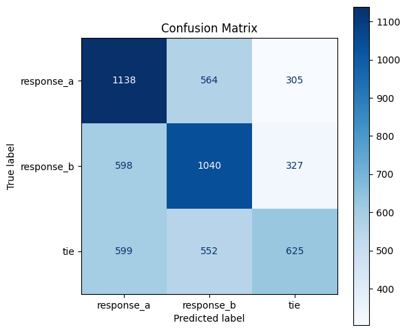

# LLM Response Preference Classification

Predicts which of two chatbot responses a user would prefer: response A, response B, or tie.

## Problem

Given a user's prompt and two responses from LLMs, predict the user's preference: response A, response B, or tie. The dataset (57,477 samples) is a collection of conversations from the Chatbot Arena, per the [competition page](https://www.kaggle.com/competitions/llm-classification-finetuning). Log loss is the main metric, which scores the predicted probabilities and penalizes confident wrong answers (accuracy is also provided).

## Approach

I used a **cross-encoder** so that the model can compare the responses with the prompt at the same time. The input was generated by concatenating the prompt with the two responses into a single sequence that was fed into the encoder:
```
[CLS] prompt [SEP] response_A [SEP] response_B [SEP]
```
A 3-block residual head maps the `[CLS]` vector to three probabilities.

**Training in stages:**

- **Encode once (Stage 0):** Feed all the data through the encoder and cache the `[CLS]` vectors.
- **Train the head (Stage 1):** Train only the head on the cached vectors.
- **Full fine-tune (Stage 2):** Fine-tune the full model from end to end.

**Details:**

- **Position-bias augmentation:** During Stage 2, the responses (Response A and Response B) and their labels are swapped at random with probability 0.5.
- **Split:** The dataset was split 80/10/10 and stratified into training, validation, and test sets. The test set was used only once after training to evaluate performance on unseen data.
- **Efficiency:** fp16 mixed precision, gradient checkpointing, and data parallelism across two T4 GPUs.
- **Tracking:** Every run is logged with MLflow.


## Results

`DeBERTa-v3-xsmall` was chosen as the encoder because of its small size, its stable training in Stage 2, and its results that matched the larger encoders. On the test set, it reached a log loss of 1.0191 and accuracy of 48.76% (compare with baseline and larger encoders below).

|Encoder (`DeBERTa-v3-*`)| Stage | Val loss &darr;| Val acc &uarr; | Test loss &darr;| Test acc &uarr;|
|-|-|-|-|-|-|
|-| Baseline (class proportions)| 1.0972|34.90%|1.0972|34.92%|
|`xsmall`|Cross-encoder, no training |1.8551|30.90%|-|-|
|`xsmall`|Cross-encoder, head only (160 ep, best 49)|1.0748|40.74%|-|-|
|`xsmall`|Cross-encoder, full fine-tuned (20 ep, best 5)|1.0309|46.85%|1.0191|48.76%|
|`small`|Cross-encoder, no training|1.3956|34.20%|-|-|
|`small`|Cross-encoder, head only (160 ep, best 91)|1.0758|40.05%|-|-|
|`small`|Cross-encoder, full fine-tuned (20 ep, best 4)|1.0519|47.63%|1.0367|48.61%|
|`base`|Cross-encoder, no training|1.2848|34.20%|-|-|
|`base`|Cross-encoder, head only (160 ep, best 106)|1.0620|41.58%|-|-|
|`base`|Cross-encoder, full fine-tuned (5 ep, best 4)| 1.0317|48.31%|1.0204|48.76%|

Test columns use the held-out 10% split. *No training* is the pretrained encoder with an untrained head. *Head only* trains just the classifier head. *Full fine-tuned* trains the encoder and the head.

**Note:** The `DeBERTa-v3-small` and `DeBERTa-v3-base` numbers came from earlier runs and later attempts didn't train reliably. So, `DeBERTa-v3-xsmall` is the final encoder.



## What I learned

- **Fine-tuning can be unstable.** Freezing the encoder and training the classifier head only (Stage 1) was stable across all encoders with differences less than one percentage point. However, when fine-tuning the full model (Stage 2) with encoders `small` and `base`, sometimes the model trained well and other times it degenerated. Small differences in Stage 1 determined how training went in Stage 2 for `small` and `base`. Warmup and clipping helped `small`'s accuracy escape its plateau, but not its log loss (the checkpoint metric). The smaller encoder `xsmall` turned out to be more stable in Stage 2, and hence, was the chosen encoder.
- **A bigger encoder did not mean better results.** `xsmall`, `small`, and `base` reached the same accuracy of about 48-49% within 5 epochs, so the limit may be the dataset (noisy labels or truncated inputs) and not the model size.
- **Two-stage training made experiments cheap.** Caching the embeddings once took 10 min and training the head only with these embeddings took 11 min for 160 epochs. This made it affordable to experiment with several heads (3 to 15 blocks each).

## Next steps

- **Test-time augmentation:** For each prompt, make two predictions with responses permuted: (P, A, B) and (P, B, A). Map the second prediction's A/B probabilities back, then take the average. The confusion matrix showed that there is a small lean toward A that this would counteract.
- **Longer inputs:** Have inputs be longer than 512 tokens. DeBERTa-v3 can handle longer sequences because it uses relative positions. Currently, the responses are truncated at 239 tokens while the median for responses is about 230 and max is 6,377 for response A and 15,670 for response B.
- **Stable training for `small` and `base`:** Increase the number of steps in the warmup and try a separate learning rate for the head in Stage 2. Stage 2 was unstable for the larger encoders.
- **Multiple seeds:** Repeat the final run with different seeds and analyze the results. Current results are from a single seed and small differences could be noise.

## Repository structure

| File | Contents |
|---|---|
| `llm_preference_classification.ipynb` | Main notebook: data, model, training, results |
| `models.py` | Classifier head and full model |
| `preference_datasets.py` | Datasets and batching |
| `training.py` | Training, evaluation, seeding, timing and GPU memory tracking |
| `text_utils.py` | Text cleaning and token statistics |
| `plotting.py` | Training graphs and confusion matrix |
| `tests/` | Unit tests (`pytest`) |
| `images/`|Training graphs and confusion matrix images|
|`conftest.py`|Lets `pytest` import the project modules|
|`requirements.txt`|Pinned package versions|
|`LICENSE`|MIT license|

## How to run

The reported results were trained on Kaggle (2x T4 GPUs).

**Requirements:** Python 3.12 and a CUDA GPU for training.

```bash
git clone https://github.com/fernandoquintino/llm-classification-finetuning.git
cd llm-classification-finetuning
python3.12 -m venv .venv
source .venv/bin/activate
pip install -r requirements.txt
```

Download `train.csv` from the [competition data page](https://www.kaggle.com/competitions/llm-classification-finetuning/data) and place it in a new `data/` folder.

Then open the notebook:

```bash
jupyter notebook llm_preference_classification.ipynb
```

To run the unit tests:

```bash
pytest
```

## License

This project is licensed under the MIT License. See [LICENSE](LICENSE) for details.

